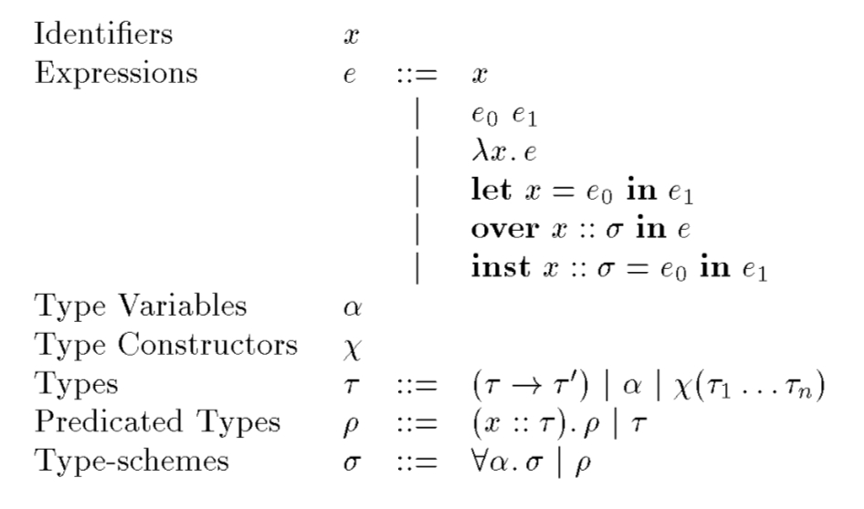
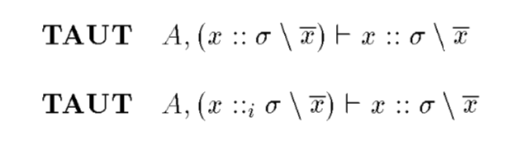
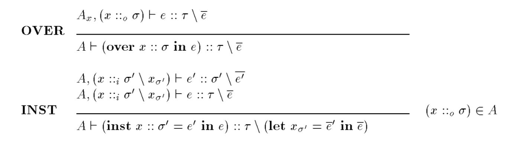
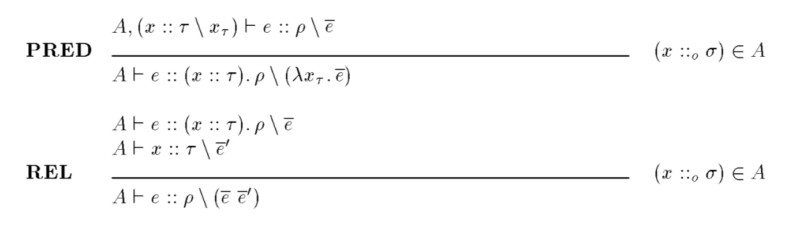

## 作ってわかる 型クラス

https://gitpitch.com/coord-e/slide-type-class-impl

---

## About me

- @coord\_e
- Writing compilers as a hobby
- Coding in Haskell for ~1y

---

### Type Classes - Introduction (1/2)

```haskell
-- simplified!
class Num a where
  mul :: a -> a -> a
```

---

### Type Classes - Introduction (2/2)

```haskell
mulInt :: Int -> Int -> Bool
mulFloat :: Int -> Int -> Bool

square :: Num a => a -> a
square x = mul x x


instance Num Int where
  mul = mulInt

instance Num Float where
  mul = mulFloat
  
main = print (square 3.0)
-- => 9.0
```

---

### Essense of Type Classes

@ul

- Same name for different implementation
- Dispatch depending on its type
- "ad-hoc polymorphism"

@ulend

---

### Inspection (1/3)

"Type Constraint"

```haskell
> :k Num
Num :: * -> Constraint

> :k Num Int
Num Int :: Constraint
```

---

### Inspection (2/3)

type constraint disappears when typed

```haskell
> :t mul
mul :: Num a => a -> a -> a

> :t mul :: Int -> Int -> Int
mul :: Int -> Int -> Int :: Int -> Int -> Int

> :t square
square :: Num a => a -> a

> :t square (1 :: Int)
square (1 :: Int) :: Int
```

---

### Inspection (3/3)

...or not

```haskell
> :t square 'a'
...
• No instance for (Num Char) arising from a use of ‘square’
...
```

---

### To-do?

@ul

- Introduce type constractor with kind `* -> Constraint` in class declaration
- Introduce "Type Constraint" for
  * overloaded name, and
  * functions which contrain constrainted name appears in it
- Resolve "Type Constraint" when
  * suitable instance is found

@ulend

---

### Questions

@ul

- How can we replace names with suitable implementation?
  * overloaded names, just obtain it from instance declaration
  * what if it is an ordinally function with type constraint?

@ulend
  
---

### Solution

**Dictionary-passing**

```haskell
square x = mul x x
main = print $ square 1
-- is translated to
square mul' x = mul' x x
main = print $ square mulInt 1
```

---

### Here a paper comes...

- Wadler, Philip, and Stephen Blott. "How to make ad-hoc polymorphism less ad hoc." Proceedings of the 16th ACM SIGPLAN-SIGACT symposium on Principles of programming languages. ACM, 1989.

---

### Translation

- Perform typing and translation at once
  * Type-directed translation
- Use "Context" instead of type environment
  * close to type environment, but overloadings and instantiations are distinguished

---

### Translation rules (1/3)



---

### Translation rules (2/3)




---

### Translation rules (3/3)



---

### Example

```ocaml
over mul :: ∀a. Num a in
inst mul :: Num Int = mulInt in
let square = λx. mul x x in
square (mul 1)
```

---

### Questions

- When can `PRED` be applied?

```haskell
square x = mul x x
```

- How to apply `TAUT` in inference algorithm?

```haskell
main = print (mul 1 2)
```

---

### Solution

- `PRED` is applied just before the expression is bound to a name
  * just before the generalization
- Use "placeholder" to determine an appropriate instance

---

```haskell
square x = mul x x
```

---

insert a placeholder in place of the overloaded name

```haskell
square x = <1> x x
```

---

`<1> :: 'a -> 'a -> 'b`

Can't find a suitable instance, so apply `PRED`


```haskell
square mul' x = mul' x x
```

resulting to: `square :: Num a => a -> a`

---

```haskell
print (square 3.0)
```

---

in context: `square :: Num a => a -> a`

found a constraint in type, so apply `REL`


```haskell
print (square mul 3.0)
```

---

insert a placeholder in place of the overloaded name

```haskell
print (square <1> 3.0)
```

---

`<1> :: Float -> Float -> Float`

found instance: `mulFloat`


```haskell
print (square mulFloat 3.0)
```

---

### Q: OK, what if there are more than one

A: Use tuples

```haskell
class Num a where
  numD :: (a -> a -> a, a -> a -> a, a -> a) 

add = fst numD
mul = snd numD
neg = thd numD


instance Num Int where
  numD = (addInt, mulInt, negInt) 

instance Num FLoat where
  numD = (addFloat, mulFloat, negFloat) 
```

---

### My Implementation

https://github.com/coord-e/ad-hoc-poly

(in progress)

---

### Working Example

<blockquote class="twitter-tweet"><p lang="ja" dir="ltr">アドホック多相の実装ですが非常にいい感じになってきました <a href="https://t.co/aACdmdvj2N">pic.twitter.com/aACdmdvj2N</a></p>&mdash; coord.e (@coord_e) <a href="https://twitter.com/coord_e/status/1190204100727562240?ref_src=twsrc%5Etfw">November 1, 2019</a></blockquote> <script async src="https://platform.twitter.com/widgets.js" charset="utf-8"></script>

---

### Thank you for listening

Reference: Wadler, Philip, and Stephen Blott. "How to make ad-hoc polymorphism less ad hoc." Proceedings of the 16th ACM SIGPLAN-SIGACT symposium on Principles of programming languages. ACM, 1989.
